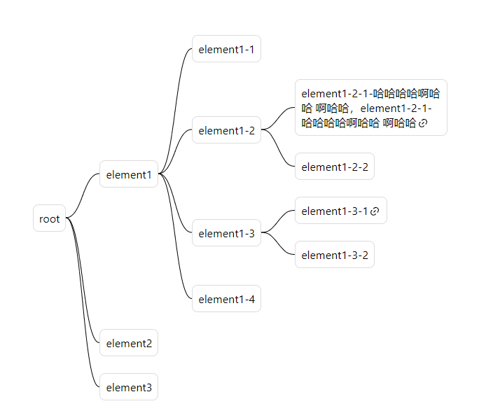

# React Simple Mind

轻量配置化思维导图组件，适用于一些不需要编辑，只展示导图的场景

[demo](https://blog.streakingman.com/react-simple-mind/)



## 配置项

```ts
interface Data {
    title: string;
    url?: string;
    children?: Data[];
}

export interface SimpleMindProps {
    // 嵌套数据
    data: Data;
    className?: string;
    // 元素类名
    elementClassName?: string;
    // 单边、双边布局
    layout?: 'singleSide' | 'doubleSide';
    // 间隙大小
    gap?: number | number[];
    // 连线颜色
    lineColor?: string;
    // 连线宽度
    lineWidth?: number;
}
```

## 使用

```shell
# npm
npm install --save react-simple-mind
# yarn
yarn add react-simple-mind
```

```css
.element {
    border: 1px solid gainsboro;
    border-radius: 8px;
    padding: 8px;
    max-width: 200px;
}
```

```tsx
import SimpleMind from 'react-simple-mind';
import 'react-simple-mind/dist/style.css';

const testData = {
    title: 'root',
    children:[...]
}

function App() {
    return (
        <SimpleMind
            elementClassName={'element'}
            data={testData}
            gap={[64, 24]}
            lineWidth={4}
            lineColor={'red'}
        />
    );
}
```
